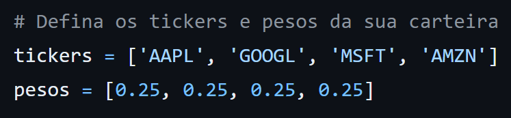
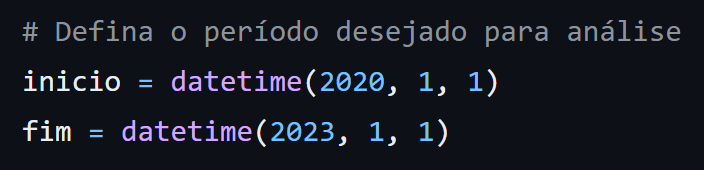
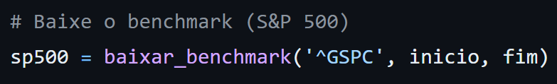
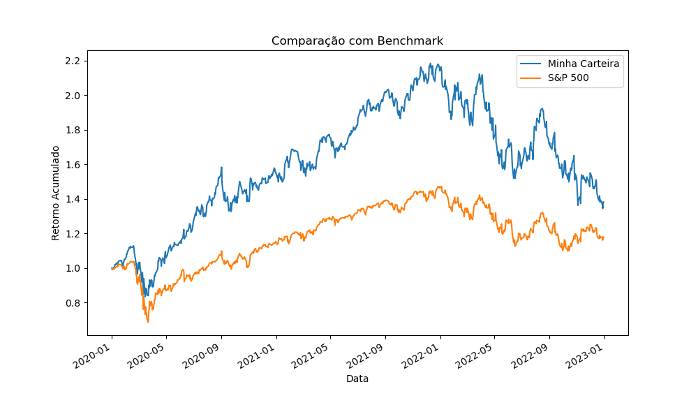

# Carteira x Benchmark

Este projeto é a companhia perfeita para quem quer ficar de olho no desempenho dos seus investimentos e dar um upgrade na sua estratégia!

## Principais Funcionalidades 🔎
- **Investigar Ativos Financeiros:**
Com a função `baixar_dados`, você pode pegar os preços ajustados de fechamento dos seus investimentos em um intervalo de tempo determinado. É como dar uma olhada no seu extrato bancário, mas para as suas ações!

- **Acompanhar a Carteira de Investimentos:**
A função `rastrear_carteira` calcula o desempenho acumulado de uma carteira de investimentos ao longo do tempo, com base nos retornos diários ponderados dos ativos.

- **Analisar um Benchmark:**
A função `baixar_benchmark` possibilita baixar os dados de um benchmark específico, como o S&P 500 ou o IBOV, e normalizar esses dados para facilitar a comparação com a carteira de investimentos.

## Exemplo de Uso ✍🏻
Vamos supor que tenho investimentos no exterior com 4 ações, e cada uma tem uma parcela igual na carteira, ou seja, 25%:

- Apple (25%)
- Google (25%)
- Microsoft (25%)
- Amazon (25%)

Como estamos trabalhando com a biblioteca `yfinance`, precisamos atribuir os *tickers* correspondentes às ações:

- 'APPL'
- 'GOOGL'
- 'MSFT'
- 'AMZN'

Assim, os primeiros argumentos ficariam:

Essa carteira-exemplo teve início em 01/01/2020, e queremos ver seu desempenho até o dia 01/01/2023. 

Como estamos usando a biblioteca `datetime`, precisamos ajustar as datas para o padrão americano.

Assim, teríamos:

Por fim, o último passo é escolher o *benchmark* ao qual queremos comparar a carteira.

Por termos em carteira ações de tecnologia da bolsa americana, faz todo sentido compararmos ao *benchmark* correspondente, o *S&P500*.

Mais uma vez, por usarmos a a biblioteca `yfinance`, precisamos atribuir o *ticker* correspondentes ao *benchmark*.

No caso do *S&P500*, o ticker é *^GSPC*

Dessa forma, passaríamos os seguintes argumentos:

E, pronto! 

Temos um gráfico que ilustra o **crescimento acumulado** da carteira de investimentos ao longo do tempo, ponderando os **retornos diários** dos ativos de acordo com os **pesos** especificados.

## Observação ⚠️

Se a sua carteira for compostas de **ações brasileiras**, por conta da biblioteca `yfinance`, é necessário adicionar **".SA"** ao final dos *tickers*:

- Petrobrás → PETR4 → **PETR4.SA**
- Vale → VALE3 → **VALE3.SA**
- Banco do Brasil → BBDC4 → **BBDC4.SA**